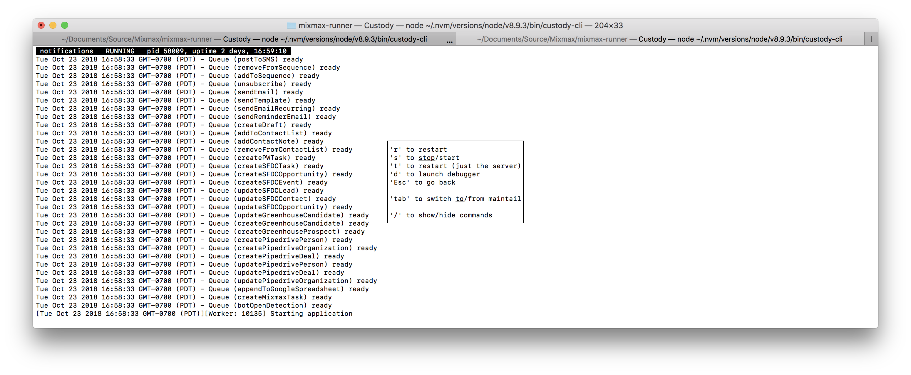

# custody-plugin-command-start-debugger

Users can start [the Node debugger] by starting a process with the `inspect` argument or `--inspect`
flag. However, if your process is run under a process monitor like Supervisor or even just nodemon,
you can't easily alter its arguments nor flags.

Luckily, Node lets you direct a running process to start the debugger by signalling the process with
[`'SIGUSR1'`]. However this method requires you to identify the process ID, which means reading it
out of your process monitor's logs, if it's logged at all. Also, Node will always start the debugger
on the same port, which prevents you from debugging multiple processes simultaneously.

And when you make a change to the process, you have to go through this rigamarole all over again.

This [custody](https://github.com/mixmaxhq/custody/) plugin fixes all that:

* it lets you launch the debugger for a given process with a single keypress
* it directs Node to find an open port for the inspector
* it tracks when a process that is being debugged restarts and reattaches the debugger after the
  process finishes restarting

## Installation

```sh
npm install -g @custody/plugin-command-start-debugger
```

Then launch `custody-cli settings` and add "@custody/plugin-command-start-debugger" to your
`.custodyrc`.

This module requires that you instrument every process you wish to debug with
[@custody/probe](https://github.com/mixmaxhq/custody-probe/#installation), please configure that
before proceeding. See [here](https://github.com/mixmaxhq/custody-probe/#debugger-support) for why.

## Usage

After opening a process' details in custody



press 'd' to launch Chrome DevTools. If you wish to assign a different key, for instance "w", edit
the "@custody/plugin-command-start-debugger" line in your `.custodyrc` to look like the following:

```json
{
  "plugins": [
    ["@custody/plugin-command-start-debugger", {
      "key": "w"
    }]
  ]
}
```

DevTools will open in a new Chromium instance due to [limitations of Chrome's automation].

If the process restarts, DevTools will briefly disconnect and then reconnect when the process
finishes restarting.

To stop debugging, simply close the DevTools tab in Chromium and/or Chromium itself.

## Contributing

We welcome bug reports and feature suggestions!

[the Node debugger]: https://nodejs.org/api/debugger.html
[`'SIGUSR1'`]: https://nodejs.org/api/process.html#process_signal_events
[limitations of Chrome's automation]: https://github.com/GoogleChrome/puppeteer/#q-why-doesnt-puppeteer-vxxx-work-with-chromium-vyyy
